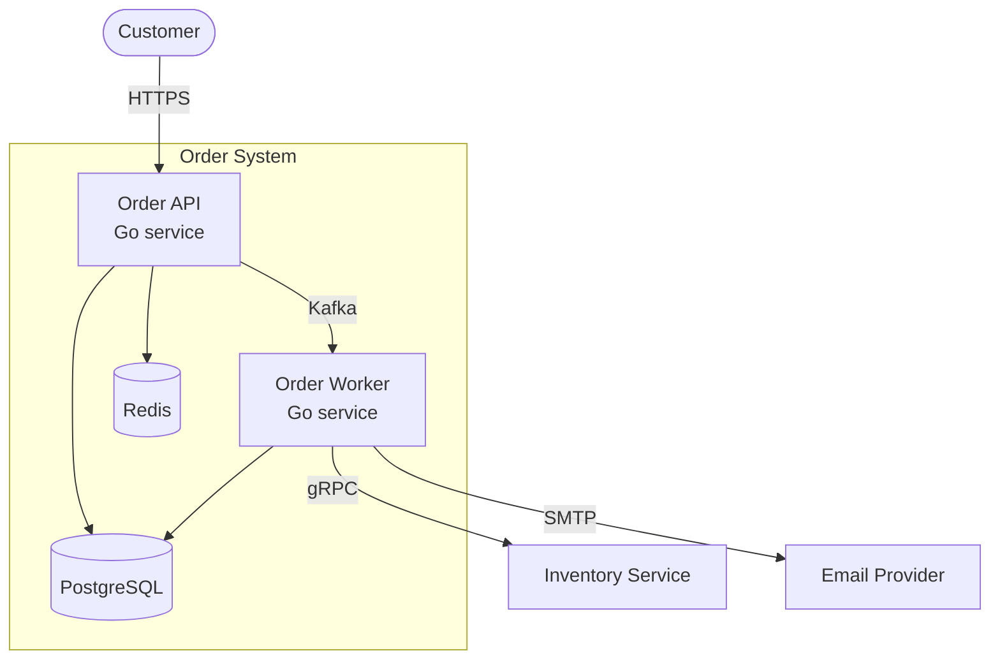
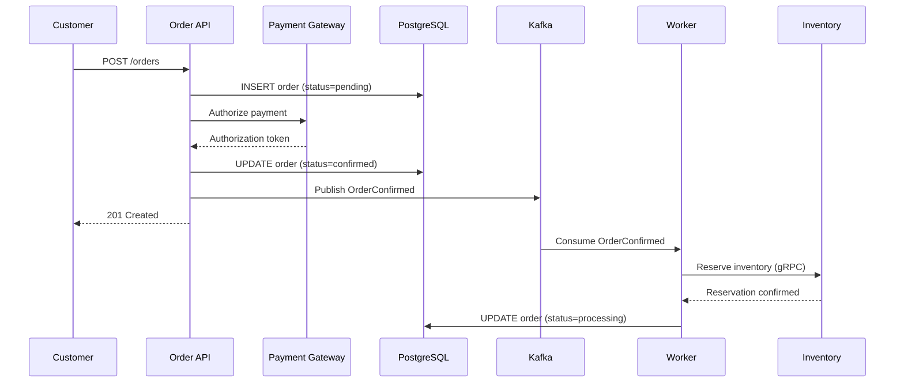
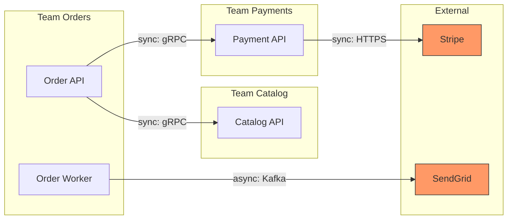

# Architecture Documentation

| Attribute     | Value                                                                              |
|---------------|------------------------------------------------------------------------------------|
| Domain        | Code Quality > Documentation                                                       |
| Importance    | High                                                                               |
| Last Updated  | 2026-03                                                                            |
| Cross-ref     | [Code Documentation](code-documentation.md), [03-architecture](../../03-architecture/) |

> ADR templates are fully covered in **03-architecture/decision-records/** -- cross-reference only, not duplicated here.

---

## 1. C4 Model Overview

The C4 model provides four hierarchical levels of abstraction for system architecture diagrams. Each level answers different questions for different audiences.

| Level      | Audience               | Shows                                        |
|------------|------------------------|----------------------------------------------|
| Context    | Everyone               | System boundaries, users, external systems   |
| Container  | Technical stakeholders  | Services, databases, queues, protocols       |
| Component  | Developers             | Internal modules within a container          |
| Code       | Developers (on demand) | Class/module-level detail                    |

Rule: always create Context and Container diagrams. Component diagrams for complex services only. Code-level diagrams are rarely maintained manually -- generate from source.

## 2. Diagrams-as-Code

### Mermaid (native in GitHub, GitLab, Notion)



### Structurizr DSL

```
workspace "Order Platform" {
    model {
        customer = person "Customer" "Places and tracks orders"
        admin = person "Admin" "Manages catalog and fulfillment"

        orderSystem = softwareSystem "Order System" {
            api = container "Order API" "Handles HTTP requests" "Go"
            worker = container "Order Worker" "Processes async jobs" "Go"
            db = container "PostgreSQL" "Order storage" "PostgreSQL 16" "database"
            cache = container "Redis" "Session and cache" "Redis 7" "database"
            queue = container "Kafka" "Event streaming" "Kafka 3.7" "queue"
        }

        inventorySystem = softwareSystem "Inventory Service" "Manages stock" "Existing System"
        emailProvider = softwareSystem "Email Provider" "Sends transactional email" "External"

        customer -> api "Places orders" "HTTPS/JSON"
        admin -> api "Manages orders" "HTTPS/JSON"
        api -> db "Reads/writes orders" "SQL/TLS"
        api -> cache "Session lookup" "Redis protocol"
        api -> queue "Publishes events" "Kafka protocol"
        worker -> queue "Consumes events" "Kafka protocol"
        worker -> db "Updates order state" "SQL/TLS"
        worker -> inventorySystem "Reserves stock" "gRPC/mTLS"
        worker -> emailProvider "Sends notifications" "SMTP/TLS"
    }

    views {
        systemContext orderSystem "Context" {
            include *
            autolayout lr
        }
        container orderSystem "Containers" {
            include *
            autolayout lr
        }
    }
}
```

### D2

```d2
direction: right

customer: Customer {shape: person}
order-api: Order API {shape: rectangle; style.fill: "#4A90D9"}
postgres: PostgreSQL {shape: cylinder}
redis: Redis {shape: cylinder}
kafka: Kafka {shape: queue}
worker: Order Worker {shape: rectangle}
inventory: Inventory Service {shape: rectangle; style.stroke-dash: 5}

customer -> order-api: HTTPS
order-api -> postgres: SQL
order-api -> redis: Cache
order-api -> kafka: Publish
kafka -> worker: Consume
worker -> postgres: Update
worker -> inventory: gRPC
```

## 3. System Context Diagram

Document three things: (1) what the system does, (2) who uses it, (3) what external systems it depends on.

```markdown
## System Context: Order Platform

### Purpose
Manages the full order lifecycle from cart checkout through fulfillment
and delivery tracking.

### Users
| Actor     | Role                           | Interaction          |
|-----------|--------------------------------|----------------------|
| Customer  | Places and tracks orders       | Web/Mobile via HTTPS |
| Admin     | Manages catalog, fulfillment   | Admin UI via HTTPS   |
| Warehouse | Picks and ships orders         | Warehouse app via API|

### External Dependencies
| System            | Owner           | Protocol     | SLA      |
|-------------------|-----------------|--------------|----------|
| Payment Gateway   | Stripe          | HTTPS/REST   | 99.99%   |
| Inventory Service | Warehouse Team  | gRPC/mTLS    | 99.9%    |
| Email Provider    | SendGrid        | HTTPS/REST   | 99.95%   |
| Address Validation| Google Maps     | HTTPS/REST   | 99.9%    |
```

## 4. Sequence Diagrams for Key Flows



## 5. Architecture Characteristics Documentation

```markdown
## Non-Functional Requirements: Order Platform

### Availability
- Target: 99.95% uptime (21.9 min downtime/month)
- Strategy: Multi-AZ deployment, health-check-based failover
- Measurement: Synthetic monitoring + real user monitoring

### Performance
- P50 API latency: < 100ms
- P99 API latency: < 500ms
- Order creation throughput: 500 orders/sec sustained

### Scalability
- Horizontal scaling: 2-20 API pods (HPA on CPU/request rate)
- Database: Read replicas for queries, primary for writes
- Design limit: 10M orders/month without re-architecture

### Security
- All inter-service traffic: mTLS
- PII encryption at rest (AES-256-GCM)
- SOC 2 Type II compliant

### Data Durability
- RPO: 0 (synchronous replication)
- RTO: < 5 minutes (automated failover)
```

## 6. Technology Radar

```markdown
## Technology Radar — Q1 2026

### Adopt (use in production)
- Go 1.23 for backend services
- PostgreSQL 16 for relational storage
- Kafka 3.7 for event streaming
- Terraform for infrastructure
- OpenTelemetry for observability

### Trial (use in non-critical projects)
- Valkey for caching (Redis fork)
- Deno 2 for edge functions
- DuckDB for analytics queries

### Assess (research and prototype)
- CockroachDB for multi-region SQL
- WebTransport for real-time features

### Hold (do not start new work)
- MongoDB (migrating to PostgreSQL)
- REST for inter-service (use gRPC)
- Jenkins (migrated to GitHub Actions)
```

## 7. Service Catalog with Backstage

```yaml
# catalog-info.yaml (Backstage entity)
apiVersion: backstage.io/v1alpha1
kind: Component
metadata:
  name: order-api
  description: Manages order lifecycle from creation to fulfillment
  tags: [go, grpc, kafka]
  annotations:
    github.com/project-slug: myorg/order-api
    backstage.io/techdocs-ref: dir:.
    pagerduty.com/service-id: P1234AB
    grafana/dashboard-selector: "order-api"
  links:
    - url: https://api-docs.internal/order-api
      title: API Docs
      icon: docs
spec:
  type: service
  lifecycle: production
  owner: team-orders
  system: order-platform
  providesApis:
    - order-api-rest
    - order-events-async
  consumesApis:
    - inventory-api-grpc
    - payment-gateway-rest
  dependsOn:
    - resource:order-db
    - resource:order-cache
    - resource:order-kafka
```

## 8. Keeping Architecture Docs Alive

### Automated Diagram Generation

```yaml
# .github/workflows/architecture-docs.yml
name: Architecture Docs
on:
  push:
    branches: [main]
    paths: ['docs/architecture/**', 'catalog-info.yaml']

jobs:
  generate:
    runs-on: ubuntu-latest
    steps:
      - uses: actions/checkout@v4

      - name: Generate Structurizr diagrams
        run: |
          docker run --rm -v $(pwd)/docs:/workspace structurizr/cli \
            export -workspace /workspace/workspace.dsl -format mermaid

      - name: Render Mermaid to PNG
        uses: mermaid-js/mermaid-cli-action@v2
        with:
          input: docs/architecture/*.mmd
          output: docs/architecture/rendered/

      - name: Validate Backstage catalog
        run: npx @backstage/cli catalog validate catalog-info.yaml

      - name: Commit rendered diagrams
        uses: stefanzweifel/git-auto-commit-action@v5
        with:
          commit_message: "docs: regenerate architecture diagrams"
```

### Review Cadence

```markdown
## Architecture Documentation Review Schedule

| Artifact                  | Cadence    | Owner          | Trigger                    |
|---------------------------|------------|----------------|----------------------------|
| System context diagram    | Quarterly  | Tech Lead      | New external dependency    |
| Container diagram         | Monthly    | Team Lead      | New service added/removed  |
| Technology radar          | Quarterly  | Architecture guild | Guild meeting           |
| NFR document              | Bi-annually| SRE + Dev Lead | SLA renegotiation          |
| Service catalog entries   | On change  | Service owner  | PR to catalog-info.yaml    |
| ADRs                      | On decision| Decision maker | Any significant tech choice|
```

## 9. Documenting Dependencies



---

## Best Practices

1. **Start with C4 Context and Container** -- these two diagrams provide 80% of the architectural understanding for 20% of the effort.
2. **Use diagrams-as-code** -- store Mermaid/Structurizr/D2 source in the repository alongside the code it describes.
3. **Automate diagram rendering in CI** -- render on merge to main so diagrams never drift from their source.
4. **Maintain a service catalog** -- use Backstage or a simple YAML registry; every service must have an owner, dependencies, and runbook link.
5. **Document architecture characteristics quantitatively** -- "highly available" is meaningless; "99.95% uptime, <500ms P99 latency" is actionable.
6. **Record decisions in ADRs** -- every significant technology or design choice must have an ADR (see 03-architecture/decision-records/).
7. **Review architecture docs on a fixed cadence** -- quarterly for context diagrams, monthly for container diagrams, on-change for service catalog.
8. **Maintain a technology radar** -- make adopt/trial/assess/hold status explicit so teams make consistent technology choices.
9. **Include sequence diagrams for critical flows** -- payment, authentication, and data sync flows must have up-to-date sequence diagrams.
10. **Link diagrams to source code** -- every container/component in a diagram should link to the repository or service catalog entry.

---

## Anti-Patterns

| #  | Anti-Pattern                   | Problem                                                        | Fix                                                      |
|----|--------------------------------|----------------------------------------------------------------|----------------------------------------------------------|
| 1  | Stale whiteboard photos        | Architecture diagrams are unversioned JPEGs from 2 years ago   | Diagrams-as-code in the repo, rendered in CI             |
| 2  | Over-documentation             | 200-page architecture doc nobody reads                         | C4 levels: 4 diagrams + NFRs + ADRs cover 95% of needs  |
| 3  | Wiki sprawl                    | Architecture info spread across Confluence, Notion, Google Docs| Single source of truth in the repo or Backstage          |
| 4  | Missing NFRs                   | "Make it fast" without measurable targets                      | Quantify every quality attribute with targets and measurement |
| 5  | No ownership on diagrams       | Nobody updates diagrams when services change                   | Assign diagram ownership; validate in service PR templates|
| 6  | Code-level C4 maintained manually | Class diagrams hand-drawn and immediately stale             | Generate code-level views from source; maintain only L1-L3|
| 7  | Technology decisions in chat    | "We agreed in Slack to use Redis" with no record              | Every decision in an ADR; link Slack thread as context   |
| 8  | Diagrams without context       | Boxes and arrows with no legend, protocol, or data flow labels | Every arrow: label with protocol, direction, sync/async  |

---

## Enforcement Checklist

- [ ] C4 Context diagram exists and is reviewed quarterly
- [ ] C4 Container diagram exists and is updated when services change
- [ ] All diagrams use diagrams-as-code (Mermaid/Structurizr/D2) stored in the repo
- [ ] CI renders diagrams and validates Backstage catalog on merge
- [ ] Service catalog entry exists for every production service
- [ ] Architecture characteristics (NFRs) are documented with quantitative targets
- [ ] Technology radar is published and reviewed quarterly
- [ ] Sequence diagrams exist for all critical business flows
- [ ] Every significant decision has an ADR (cross-ref: 03-architecture/decision-records/)
- [ ] Architecture docs have a defined review cadence and owner
